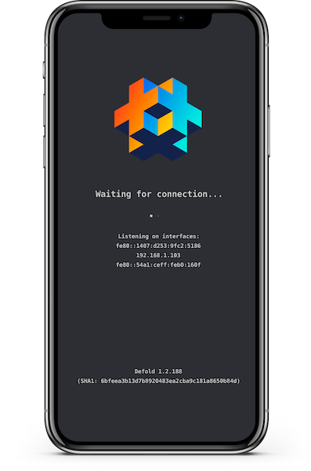

# Mobile development app
Empty Defold application suitable for iterative development using the Defold editor and hot reload. Learn more in the [official manual](https://defold.com/manuals/dev-app).

## Important!
Make sure to build the app in debug mode. Otherwise the debug services will be disables, and you will not be able to connect to the app.
